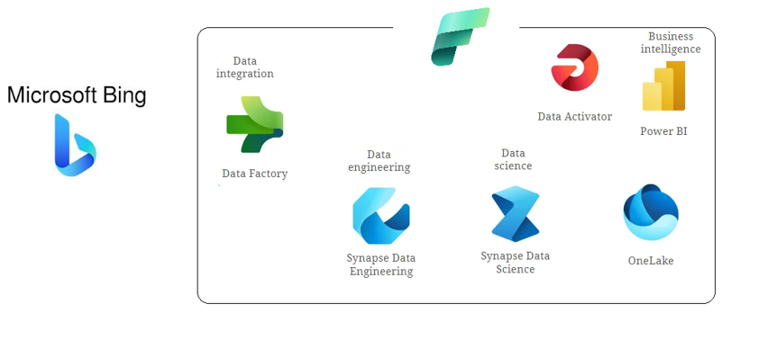

# Daily-News-Collection-and-Processing-Pipeline-with-Microsoft-Fabric

This project draws inspiration from YouTube video by Mr. K Talks Tech, titled [Build Your End-to-End Project in Just 3 Hours: Master Azure Data Engineering | Bing Data Analytics.](https://youtu.be/yHU9ADk10eQ?si=-_hUBjgTU65DZ35a). Full credit goes to them for the original content and inspiration.

This project provides an end-to-end solution for gathering and analyzing daily news content using Microsoft Fabric’s Saas based architecture data engineering platform. This project utilizes the [Bing Web Search API](https://www.microsoft.com/en-us/bing/apis/bing-web-search-api) to collect recent news articles, perform sentiment analysis, and present the insights via an interactive Power BI dashboard.

## Technologies Used

Project is based on Microsoft Fabric. The primary components of this pipeline include Microsoft Fabric's: 
- **Data Ingestion**
  - Data Factory
- **Storage**
  - Lakehouse (both raw files and tables)
- **Processing and orchestration**
  - Jupyter Notebooks (PySpark)
- **Visualization**
  - PowerBI
- **Alerts and Notifications**
  - Data Activator
Each component playing a vital role in the seamless flow of data collection, processing, and visualization. Automated alerts ensure timely access to new data, allowing for up-to-date reviews of news sentiment and trends.

## Architecture Diagram

### Data Factory Pipeline

The pipeline includes the following primary tasks:

1. **Copy Latest News**: Use the Bing Web Search API to retrieve "latest news" and store the results as Bing_latest_news.JSON in the lakehouse.
2. **Data Transformation**: Convert Bing_latest_news.JSON into a structured Delta table format.
3. **Sentiment Analysis**: Apply a pre-trained machine learning model to determine whether each article's description has a positive, negative, or neutral sentiment.

## Setup

### 1. Azure
1. Create Bing Resource (standard version is free, and it'll be enough for this project)

### 2. Microsoft Fabric
1. Set up Microsoft Fabric (60 days free trial)
2. Create new Space *BingNewsDashboard*

#### 2.1. **Lakehouse**
1. Go to Data Engineering
2. Create Lakehouse `bing_lake_db`

#### 2.2. **Notebooks**
1. Go to Data Science
2. Create New Notebook (`Process raw JSON file`): 
   - Write a notebook, change all items marked with `#TODO` (Code available in `./notebooks` subdir in this repo)
   - Add Lakehouse (`bing_lake_db`) as source
3. Create New Notebook (`Process Sentiment Analysis`): 
   - Write a notebook, change all items marked with `#TODO` (Code available in `./notebooks` subdir in this repo)
   - Add Lakehouse (`bing_lake_db`) as source

#### 2.3. **Pipeline**

Go to Data Engineering & create new Data Pipeline named `bing news data ingestion`

Before creating tasks, click on empty area and create a parameter named `search_term` with a default value `latest news`.

Then, create the following tasks in the pipeline:

1. **Copy Data (`Copy Latest News`)**
   - Source:
     - Connection: New >> REST
     - Relative URL: `?q=@{pipeline().parameters.search_term}&count=100&mkt=en-US`, where:
       - `?q=@{pipeline().parameters.search_term}`: it is a typical search query. It uses the parameter "latest news" we created in step 2
       - `count=100`: increase count of news from 10 (standard) to 100
       - `mkt=en-US`: limit news to US market\
       (you can play with different parameters using [News Search APIs v7 query parameters](https://learn.microsoft.com/en-us/bing/search-apis/bing-news-search/reference/query-parameters))
     - Additional headers >> New:
       - Name: `Ocp-Apim-Subscription-Key` (taken from [News Search API v7 headers](https://learn.microsoft.com/en-us/bing/search-apis/bing-news-search/reference/headers) documentation)
       - Value: `Insert value of endpoint key from your Bing Search resource in azure`
   - Destination: as per the below screenshot
     
2.  **Notebook (`Data Transformation`)**
  - Settings:
    - Workspace: `Bing Search`
    - Notebook: `Process raw JSON file` (created in earlier step)
3. **Notebook (`Sentiment Analysis`)**
  - Settings:
    - Workspace: `Bing Search`
      - Notebook: `Bing Sentiment Analysis` (created in earlier step)

#### 2.4. **Semantic**
Move to this step after you ran the above pipeline at least once.

**Create the model**
1. Go to your `bing_lake_db`
2. Select a table `sentiment analysis`
3. Create New semantic model
   - name it `bing-news-dashboard-model`
   - select table `sentiment_analysis`

Once you created the semantic model, you can modify it:
1. Go to model
2. Click `Open Data Model`
3. Change data category of the `url` column:
   - Click `url`
   - Go to properties
   - Change data category to `Web URL`.\
    (This will change the url column into a hyperlink in your report, which you'll create in the next step)
1. Add new measures (`Negative Sentiment %`, `Positive Sentiment %`, `Neutral Sentiment %`):
   - Click `New Measure`
   - Add three new measures using the code in `./semantic_model` subdir\
    (You can use those measure when creating a PowerBI report (next step))

#### 2.5. **Power BI**
1. Go to your semantic model `bing-news-dashboard-model`
2. Click `Explore this Data` >> `Auto-Generate report`\
    
4. AI will auto-genearte a nice report for you.
5. You can add a new page to create custom report (using custom measures and modified columns which you did earlier)\
   

#### 2.6. **Data Activator**

If you want to set an alert:
1. right-click on a measure in your Power BI report
2. Click set alert
3. Change condition
4. Select action (email or teams)

## Usage

1. **Run ETL Pipeline**: Trigger the pipeline to start the data migration process.
2. **Schedule ETL Pipeline**: You can schedule your pipeline to run daily at 6AM, giving you fresh news every morning
3. **Alert**: You'll be notified every time you anything changes in your report. (so you know new news are there!)
4. **Monitor**: You can use Fabric's Monitor functionality to see the runs

## Contact
For any questions or inquiries, please contact me at muzzamilnagda@outlook.com

Thanks for reading!
